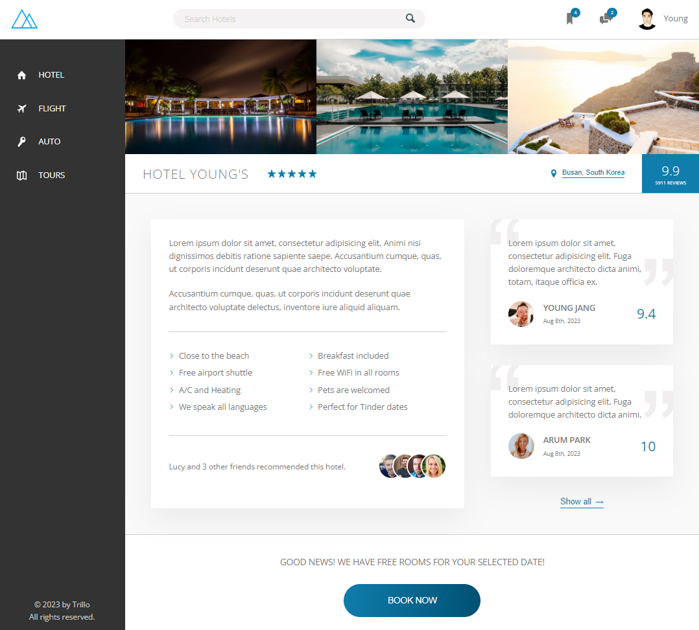
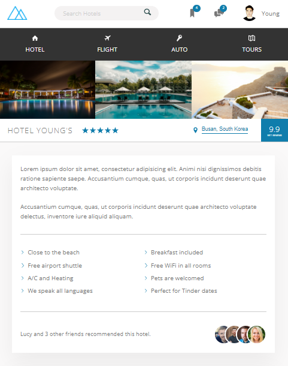

 

---

# Hotel Young's (SCSS Project - Design Prototype)

## Description



This single-page-design-focused application is a practice project utilizing features of Sassy CSS and advanced CSS styling properties. Button animations are done with keyframes and animations. The application is responsive and desktop-first. The application is also built with BEM methodology. The application is built with HTML, CSS and SCSS, mainly focusing on the use of 'flex' and SCSS features.

Responsive design is done with media queries for different screen sizes:



Please check out installation section on this README before running the application.

---

## Table of Contents

- [Installation](#installation)
- [Usage](#usage)
- [Credits](#credits)
- [Contributing](#contributing)
- [Tests](#tests)
- [Questions](#questions)

---

## Installation

You can simply visit the following link for live view of the page: https://jyoungjoon.github.io/hotel-youngs/

OR

You can run this program in your terminal.

First, to install necessary dependencies, run the following command:

```bash
npm i
```

---

## Usage

Once after you've installed dependencies, run the application by opening index.html in your browser.

---

## Credits

Thank you, Mr. Schmedtmann, for great advice and tips on SCSS and advanced CSS styling properties!

---

## Contributing

For contributions, please create a new branch of the project and submit a pull request. Any contributions are greatly appreciated. Issues can be submitted in the issues section of the repo or by emailing me directly (see Questions section below).

---

## Tests

Test feature is not available at this time.

---

## Questions

If you have any questions about the repo, open an issue or contact me directly at:

Github: [jyoungjoon](https://github.com/jyoungjoon)

Email: lifescriptified@gmail.com

---
